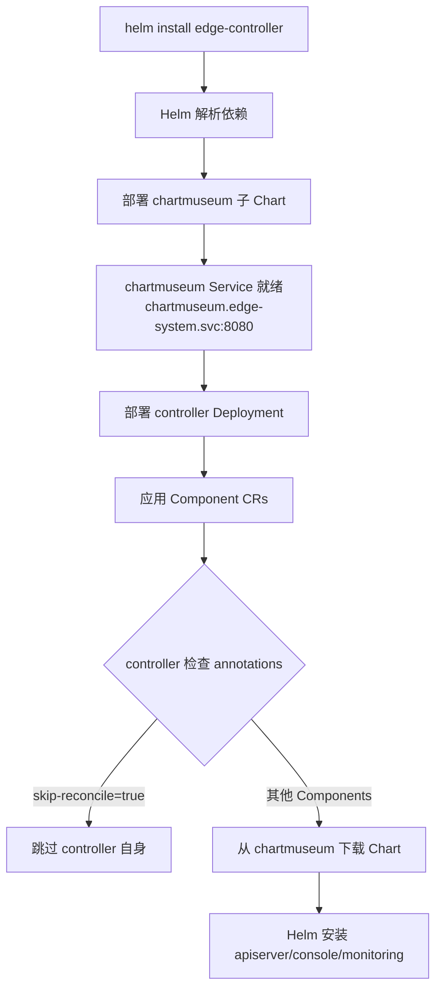

# Edge Platform Installer

统一的 Helm Chart 架构，支持一条命令安装整个 Edge 平台。

## 🏗️ 架构设计

### Chart 依赖架构

```
edge-controller (父 Chart)
├── Chart.yaml
│   └── dependencies:
│       └── chartmuseum (子 Chart)  ← 依赖关系确保部署顺序
├── charts/
│   └── chartmuseum/
│       ├── Chart.yaml
│       ├── values.yaml
│       └── templates/
│           ├── deployment.yaml
│           └── service.yaml  (固定名称: chartmuseum)
├── crds/  ← 所有 CRD 统一管理
│   ├── iam.theriseunion.io_*.yaml
│   ├── scope.theriseunion.io_*.yaml
│   └── ...
└── templates/
    ├── controller/  (Controller Deployment)
    └── components/  (Component CRs)
        ├── apiserver.yaml
        ├── console.yaml
        ├── controller.yaml  (skip-reconcile)
        └── monitoring.yaml
```

### 部署流程



## ✨ 核心特性

### 1. Helm 依赖管理
- **自动顺序保证**：chartmuseum 作为子 Chart，Helm 自动确保先部署
- **版本锁定**：通过 `Chart.yaml` 的 `dependencies` 字段管理版本
- **解耦部署**：chartmuseum 可独立升级

### 2. 固定 Service 命名
```yaml
# edge-controller/values.yaml
chartmuseum:
  fullnameOverride: "chartmuseum"  # 固定名称
```

所有 Component CR 使用统一 URL：
```
http://chartmuseum.{namespace}.svc:8080/charts/{chart-name}-{version}.tgz
```

### 3. Controller 自跳过机制
```yaml
# templates/components/controller.yaml
apiVersion: ext.theriseunion.io/v1alpha1
kind: Component
metadata:
  name: edge-controller
  annotations:
    ext.theriseunion.io/skip-reconcile: "true"      # 跳过 reconcile
    ext.theriseunion.io/pre-installed: "true"       # 标记为预安装
    ext.theriseunion.io/installation-method: "helm-direct"
spec:
  enabled: true
  version: v1.0.0
  # 无 chart 字段 - 已通过 Helm 直接安装
```

Controller 识别 annotation 并跳过：
```go
const (
    annotationSkipReconcile = "ext.theriseunion.io/skip-reconcile"
    // ...
)

if comp.Annotations[annotationSkipReconcile] == "true" {
    return ctrl.Result{}, nil  // 跳过
}
```

### 4. 统一 CRD 管理
- **集中管理**：所有 CRD 在 `edge-controller/crds/` 中
- **避免冲突**：edge-apiserver Chart 不包含 CRD
- **单一来源**：确保 CRD 版本一致

### 5. 自动清理打包
```makefile
package-charts: clean-charts  # 先清理旧包
    helm package ...
```

避免旧 Chart 包污染镜像。

## 🚀 快速开始

### 前置条件
- Kubernetes 1.24+
- Helm 3.0+
- Docker（用于构建镜像）

### 步骤 1: 构建 ChartMuseum 镜像

```bash
cd /Users/neov/src/github.com/edgekeel/apiserver/edge-installer

# 清理并打包所有 Charts（自动清理旧包）
make docker-build-museum

# 推送到镜像仓库
make docker-push-museum
```

**打包的 Charts**：
- edge-apiserver
- edge-console
- edge-controller
- edge-monitoring
- kubeedge
- vcluster
- yurt-manager
- yurthub

### 步骤 2: 安装 Edge Platform

```bash
# 一键安装（推荐）
helm install edge-platform ./edge-controller \
  --namespace edge-system \
  --create-namespace

# 自定义安装模式
helm install edge-platform ./edge-controller \
  --namespace edge-system \
  --create-namespace \
  --set global.mode=host \
  --set chartmuseum.image.tag=main
```

### 步骤 3: 验证安装

```bash
# 检查 chartmuseum（应该先就绪）
kubectl get pods -n edge-system -l app.kubernetes.io/name=chartmuseum

# 检查 controller
kubectl get pods -n edge-system -l app.kubernetes.io/name=edge-controller

# 检查 Component CRs
kubectl get components -n edge-system

# 检查自动安装的组件
kubectl get pods -n edge-system | grep edge-apiserver
kubectl get pods -n edge-system | grep edge-console
kubectl get pods -n observability-system
```

## 📋 安装模式

| 模式 | 组件 | 适用场景 |
|------|------|----------|
| **all** | apiserver + controller + console + monitoring | 单机/测试环境 |
| **host** | apiserver + controller + console + monitoring | 主集群 |
| **member** | apiserver + controller + monitoring | 成员集群（无 console） |
| **none** | controller only | 仅基础设施 |

配置方式：
```yaml
global:
  mode: "all"  # 修改此值
```

## ⚙️ 配置说明

### 关键配置项

```yaml
# edge-controller/values.yaml

# 全局配置
global:
  mode: "all"                              # 安装模式
  namespace: "edge-system"                 # 命名空间
  imageRegistry: "quanzhenglong.com/edge"  # 镜像仓库前缀

# ChartMuseum 配置（子 Chart）
chartmuseum:
  enabled: true
  fullnameOverride: "chartmuseum"  # 固定 Service 名称
  image:
    repository: quanzhenglong.com/edge/edge-museum
    tag: "latest"
    pullPolicy: IfNotPresent
  resources:
    limits:
      cpu: 100m
      memory: 128Mi
    requests:
      cpu: 50m
      memory: 64Mi

# Controller 配置
controller:
  enabled: true
  replicaCount: 1
  image:
    repository: controller
    tag: "main"
  chartRepository:
    url: ""  # 自动设置为 chartmuseum Service URL

# 组件自动安装配置
autoInstall:
  apiserver:
    enabled: true
    version: "0.1.0"
    values:
      replicaCount: 1

  console:
    enabled: false  # 根据 global.mode 自动设置
    version: "0.1.0"

  monitoring:
    enabled: true
    version: "0.1.0"
    values:
      namespace: "observability-system"
      prometheus:
        enabled: true
      grafana:
        enabled: true
        # 插件下载已禁用避免网络问题
```

## 🔍 故障排查

### 1. chartmuseum 无法访问

**症状**：
```
failed to download chart: Get "http://chartmuseum.edge-system.svc:8080":
dial tcp: connect: connection refused
```

**检查步骤**：
```bash
# 1. 检查 Service
kubectl get svc chartmuseum -n edge-system
# 应显示: chartmuseum  ClusterIP  xxx.xxx.xxx.xxx

# 2. 检查 Pod
kubectl get pods -n edge-system -l app.kubernetes.io/name=chartmuseum

# 3. 检查日志
kubectl logs -n edge-system -l app.kubernetes.io/name=chartmuseum

# 4. 测试连接
kubectl run test-pod --rm -it --image=busybox -- \
  wget -O- http://chartmuseum.edge-system.svc:8080/health
```

### 2. CRD 验证错误

**症状**：
```
spec.validation.openAPIV3Schema.x-kubernetes-validations[0].rule: Forbidden:
estimated rule cost exceeds budget
```

**原因**：chartmuseum 镜像中的 Chart 包含旧版本 CRD

**解决**：
```bash
# 1. 确保源项目 CRD 已更新
cd /path/to/edge-apiserver
make manifests

# 2. 复制到 installer（如果需要）
cp config/crd/bases/*.yaml \
   /path/to/edge-installer/edge-controller/crds/

# 3. 重新构建镜像（会自动清理旧包）
cd /path/to/edge-installer
make docker-build-museum
make docker-push-museum

# 4. 重启 chartmuseum
kubectl rollout restart deployment/chartmuseum -n edge-system
kubectl wait --for=condition=ready pod \
  -l app.kubernetes.io/name=chartmuseum -n edge-system

# 5. 验证新包
kubectl exec -n edge-system deployment/chartmuseum -- \
  ls -lh /charts/
```

### 3. Grafana 插件下载失败

**症状**：
```
Error: failed to download plugin: Get "https://storage.googleapis.com/...": EOF
```

**解决**：已在模板中禁用插件下载
```yaml
# edge-monitoring/templates/grafana-deployment.yaml
# - name: GF_INSTALL_PLUGINS
#   value: "grafana-piechart-panel"
```

无需处理，Grafana 正常启动。

### 4. 镜像架构不匹配

**症状**（ARM64 环境）：
```
no matching manifest for linux/arm64/v8 in the manifest list
```

**解决**：
```bash
# 构建多架构镜像
make docker-buildx-museum
```

### 5. Controller 自己安装自己

**症状**：controller 尝试通过 Helm 安装自己

**检查**：
```bash
kubectl get component edge-controller -n edge-system -o yaml

# 应包含 annotations:
#   ext.theriseunion.io/skip-reconcile: "true"
```

**解决**：确保使用最新的 edge-controller Chart

## 🗑️ 卸载

```bash
# 卸载 Helm release
helm uninstall edge-platform -n edge-system

# 清理 CRD（可选，会删除所有自定义资源）
kubectl delete crd -l app.kubernetes.io/part-of=edge-platform

# 清理命名空间
kubectl delete namespace edge-system observability-system
```

## 🛠️ 开发指南

### 添加新组件

1. **创建 Chart**：
```bash
cd edge-installer
mkdir my-component
helm create my-component
```

2. **更新 Makefile**：
```makefile
CHARTS := edge-apiserver ... my-component
```

3. **创建 Component CR**：
```yaml
# edge-controller/templates/components/my-component.yaml
apiVersion: ext.theriseunion.io/v1alpha1
kind: Component
metadata:
  name: my-component
  namespace: {{ .Release.Namespace }}
spec:
  enabled: true
  version: "1.0.0"
  chart:
    name: my-component
    repository: http://chartmuseum.{{ .Release.Namespace }}.svc:8080
```

4. **重新打包**：
```bash
make docker-build-museum
make docker-push-museum
```

### 更新 CRD

```bash
# 1. 在 edge-apiserver 项目生成 CRD
cd /path/to/edge-apiserver
make manifests

# 2. 复制到 edge-controller
cp config/crd/bases/*.yaml \
   ../edge-installer/edge-controller/crds/

# 3. 重新打包 chartmuseum
cd ../edge-installer
make docker-build-museum
make docker-push-museum

# 4. 滚动更新 chartmuseum
kubectl rollout restart deployment/chartmuseum -n edge-system
```

### 本地测试

```bash
# 1. 本地打包（不构建镜像）
make package-charts

# 2. 检查包内容
tar -tzf bin/_output/edge-apiserver-0.1.0.tgz | grep crd
# 应该没有输出（edge-apiserver 不包含 CRD）

# 3. 模拟安装
helm install test ./edge-controller --dry-run --debug

# 4. 检查依赖
helm dependency list ./edge-controller
```

## 📚 技术细节

### Helm 依赖机制

```yaml
# edge-controller/Chart.yaml
dependencies:
  - name: chartmuseum
    version: "0.1.0"
    repository: "file://./charts/chartmuseum"
    condition: chartmuseum.enabled
```

**部署顺序保证**：
1. Helm 解析 `Chart.yaml`
2. 检测 `dependencies` 字段
3. 按依赖顺序渲染模板
4. **先部署子 Chart**（chartmuseum）
5. 子 Chart 就绪后部署父 Chart（controller）

### Service 命名规范

| 组件 | Service 名称 | 配置方式 |
|------|-------------|---------|
| chartmuseum | `chartmuseum` | `fullnameOverride` |
| controller | `controller` | `fullnameOverride` |
| edge-apiserver | `edge-apiserver` | 默认规则 |
| edge-console | `edge-console` | 默认规则 |

### Component Controller 逻辑

```go
func (r *ComponentReconciler) Reconcile(ctx context.Context, req ctrl.Request) {
    // 1. 获取 Component CR
    comp := &extv1alpha1.Component{}
    r.Get(ctx, req.NamespacedName, comp)

    // 2. 检查 skip-reconcile annotation
    if comp.Annotations[annotationSkipReconcile] == "true" {
        return ctrl.Result{}, nil  // 跳过处理
    }

    // 3. 从 chartmuseum 下载 Chart
    chart := r.downloadChart(comp.Spec.Chart.Repository)

    // 4. 使用 Helm SDK 安装
    r.Installer.Install(comp.Spec.Chart, chart)
}
```

## 📖 参考文档

- [Helm Chart 依赖](https://helm.sh/docs/chart_template_guide/subcharts_and_globals/)
- [Kubernetes CRD 最佳实践](https://kubernetes.io/docs/tasks/extend-kubernetes/custom-resources/custom-resource-definitions/)
- [ChartMuseum 文档](https://chartmuseum.com/)
- [Operator Pattern](https://kubernetes.io/docs/concepts/extend-kubernetes/operator/)

## 🤝 贡献

欢迎提交 Issue 和 Pull Request！

## 📄 License

Apache 2.0
