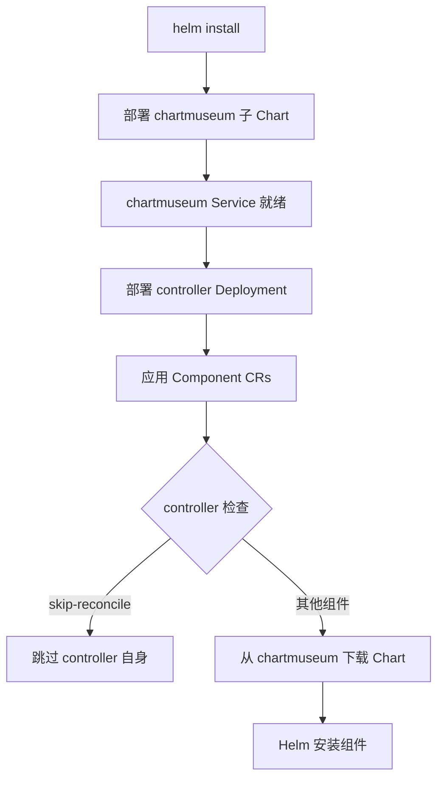

# Edge Platform Installer

统一的安装工具,基于 **Helm + ChartMuseum + Component CR** 架构实现声明式组件管理。

## 🚀 快速开始

### 一键安装 (推荐)

```bash
# 安装所有组件 (Host 集群)
# 注意: 命名空间会自动创建,无需手动 kubectl create ns
helm install edge-platform ./edge-controller \
  --namespace edge-system \
  --create-namespace

# Member 集群 (不含 Console)
helm install edge-platform ./edge-controller \
  --namespace edge-system \
  --create-namespace \
  --set global.mode=member
```

**说明**:
- `edge-system` 命名空间通过 `--create-namespace` 自动创建
- `observability-system` 命名空间通过 Chart 模板自动创建 (当 monitoring 启用时)
- 两个命名空间都会自动绑定到 `system-workspace` (通过 Controller 初始化逻辑)

### 验证安装

```bash
# 检查组件状态
kubectl get pods -n edge-system
kubectl get components -A

# 访问 Console (Host 集群)
kubectl port-forward svc/edge-console 3000:3000 -n edge-system
# 访问: http://localhost:3000
```

## 📐 架构设计

### 核心理念

```
用户声明期望状态 (Component CRs)
         ↓
Component Controller 自动调谐
         ↓
从 ChartMuseum 获取 Chart
         ↓
Helm 安装/升级组件
```

### 关键特性

- **单一入口**: 一条命令安装所有组件
- **每集群独立**: ChartMuseum 预置在镜像中,无外部依赖
- **声明式管理**: 通过 Component CR 管理生命周期
- **自动依赖**: Helm 确保 ChartMuseum 先于 Controller 部署

### 部署流程



## 📦 组件说明

### 安装模式

| 模式 | Controller | APIServer | Console | Monitoring | 适用场景 |
|------|------------|-----------|---------|------------|----------|
| **all** | ✅ | ✅ | ✅ | ✅ | 单机/测试环境 |
| **host** | ✅ | ✅ | ✅ | ✅ | 主集群 |
| **member** | ✅ | ✅ | ❌ | ✅ | 成员集群 |
| **none** | ✅ | ❌ | ❌ | ❌ | 仅基础设施 |

配置方式:
```yaml
global:
  mode: "all"  # all/host/member/none
```

### 目录结构

```
edge-installer/
├── edge-controller/           # 父 Chart (统一入口)
│   ├── Chart.yaml
│   │   └── dependencies:
│   │       └── chartmuseum    # 子 Chart,确保先部署
│   ├── charts/
│   │   └── chartmuseum/       # ChartMuseum 子 Chart
│   ├── crds/                  # 所有 CRD 统一管理
│   └── templates/
│       ├── controller/        # Controller Deployment
│       └── components/        # Component CRs
├── edge-apiserver/            # APIServer Helm Chart
├── edge-console/              # Console Helm Chart
├── edge-monitoring/           # Monitoring Helm Chart
├── Dockerfile.museum          # ChartMuseum 镜像构建
└── Makefile                   # 构建工具
```

## 🔧 开发者指南

### 构建 ChartMuseum 镜像

```bash
cd edge-installer

# 清理并打包所有 Charts
make package-charts

# 构建镜像
make docker-build-museum MUSEUM_IMG=quanzhenglong.com/edge/edge-museum:v1.0.0

# 推送镜像
make docker-push-museum MUSEUM_IMG=quanzhenglong.com/edge/edge-museum:v1.0.0

# 或一步完成 (跨平台)
make docker-buildx-museum MUSEUM_IMG=quanzhenglong.com/edge/edge-museum:v1.0.0
```

### 本地测试

```bash
# 1. 打包 Charts
make package-charts

# 2. 检查包内容
tar -tzf bin/_output/edge-apiserver-0.1.0.tgz | head

# 3. 模拟安装
helm install test ./edge-controller --dry-run --debug

# 4. 检查依赖
helm dependency list ./edge-controller
```

### 更新 CRD

```bash
# 1. 在 edge-apiserver 生成最新 CRD
cd edge-apiserver
make manifests

# 2. 复制到 edge-controller
cp config/crd/bases/*.yaml ../edge-installer/edge-controller/crds/

# 3. 重新构建 ChartMuseum 镜像
cd ../edge-installer
make docker-build-museum
make docker-push-museum

# 4. 滚动更新
kubectl rollout restart deployment/chartmuseum -n edge-system
```

### 添加新组件

1. **创建 Chart**:
```bash
mkdir my-component
helm create my-component
```

2. **更新 Makefile**:
```makefile
CHARTS := edge-apiserver edge-console ... my-component
```

3. **创建 Component CR**:
```yaml
# edge-controller/templates/components/my-component.yaml
apiVersion: ext.theriseunion.io/v1alpha1
kind: Component
metadata:
  name: my-component
spec:
  enabled: {{ .Values.autoInstall.myComponent.enabled }}
  version: {{ .Values.autoInstall.myComponent.version }}
  chart:
    name: my-component
    repository: http://chartmuseum.{{ .Release.Namespace }}.svc:8080
```

4. **重新打包**:
```bash
make docker-build-museum
make docker-push-museum
```

## ⚙️ 配置说明

### 关键配置项

```yaml
# edge-controller/values.yaml

# 全局配置
global:
  mode: "all"                              # 安装模式
  namespace: "edge-system"
  imageRegistry: "quanzhenglong.com/edge"

# ChartMuseum 配置 (子 Chart)
chartmuseum:
  enabled: true
  fullnameOverride: "chartmuseum"  # 固定 Service 名称
  image:
    repository: quanzhenglong.com/edge/edge-museum
    tag: "latest"
  resources:
    limits:
      cpu: 100m
      memory: 128Mi
    requests:
      cpu: 50m
      memory: 64Mi

# 组件自动安装配置
autoInstall:
  apiserver:
    enabled: true
    version: "0.1.0"
    values:
      replicaCount: 1

  console:
    enabled: false  # 根据 global.mode 自动设置
    version: "0.1.0"

  monitoring:
    enabled: true
    version: "0.1.0"
```

### 自定义安装

```bash
# 自定义镜像仓库和版本
helm install edge-platform ./edge-controller \
  --set global.imageRegistry=your-registry.com/edge \
  --set controller.image.tag=v1.0.0 \
  --set chartmuseum.image.tag=v1.0.0 \
  --set autoInstall.apiserver.values.image.tag=v1.0.0 \
  --set autoInstall.console.values.image.tag=v1.0.0 \
  --set autoInstall.monitoring.values.monitoringService.image.tag=v1.0.0

# 自定义组件配置
helm install edge-platform ./edge-controller \
  --set autoInstall.apiserver.values.replicaCount=3 \
  --set autoInstall.console.values.service.type=LoadBalancer \
  --set autoInstall.monitoring.enabled=false

# 允许调度到任意节点 (取消控制平面限制)
helm install edge-platform ./edge-controller \
  --set 'nodeSelector={}'
```

**Node Selector 说明**:
- **默认行为**: 所有核心组件 (controller/apiserver/console) 默认调度到控制平面节点
- 使用 Kubernetes 1.20+ 标准标签: `node-role.kubernetes.io/control-plane`
- 如需调度到任意节点，设置 `nodeSelector={}`
- 旧版本 K8s (< 1.20) 需要修改为 `node-role.kubernetes.io/master`

## 🔍 故障排查

### 常见问题

#### 1. Component CR 删除卡住

**症状**: Component CR 一直处于 Terminating 状态

**原因**: Finalizer 无法被处理 (Controller 已删除)

**正确的删除顺序**:
```bash
# 1. 删除 Component CRs (让运行中的 Controller 处理 finalizer)
kubectl delete component --all -n edge-system
kubectl delete component --all -n observability-system

# 2. 等待 Component CRs 完全删除
kubectl wait --for=delete component --all -n edge-system --timeout=120s

# 3. 卸载 Helm
helm uninstall edge-platform -n edge-system

# 4. 删除 namespace
kubectl delete namespace edge-system observability-system

# 5. 删除 CRD (可选)
kubectl delete crd -l app.kubernetes.io/part-of=edge-platform
```

**⚠️ 绝对禁止**: 手动删除 finalizer (会留下垃圾资源)

#### 2. Chart URL 404 错误

**症状**: Controller 日志显示 `failed to fetch ...edge-monitoring-.tgz : 404`

**原因**: Component CR 未指定 `version` 字段

**解决方案**:
```yaml
# ✅ 正确
apiVersion: ext.theriseunion.io/v1alpha1
kind: Component
metadata:
  name: edge-monitoring
spec:
  version: "0.1.0"  # ← 必须指定版本
  chart:
    name: edge-monitoring
```

#### 3. ChartMuseum 无法访问

**检查步骤**:
```bash
# 1. 检查 Service
kubectl get svc chartmuseum -n edge-system

# 2. 检查 Pod
kubectl get pods -n edge-system -l app.kubernetes.io/name=chartmuseum

# 3. 检查日志
kubectl logs -n edge-system -l app.kubernetes.io/name=chartmuseum

# 4. 测试连接
kubectl run test --rm -it --image=curlimages/curl --restart=Never -- \
  curl -k http://chartmuseum.edge-system.svc:8080/health
```

#### 4. CRD 验证错误

**症状**: `estimated rule cost exceeds budget`

**原因**: ChartMuseum 镜像中的 Chart 包含旧版本 CRD

**解决方案**:
```bash
# 1. 更新源项目 CRD
cd edge-apiserver
make manifests

# 2. 复制到 installer
cp config/crd/bases/*.yaml ../edge-installer/edge-controller/crds/

# 3. 重新构建镜像 (自动清理旧包)
cd ../edge-installer
make docker-build-museum
make docker-push-museum

# 4. 重启 chartmuseum
kubectl rollout restart deployment/chartmuseum -n edge-system
```

### 调试工具

```bash
# 检查 Component 状态
kubectl get components -A
kubectl get component edge-apiserver -n edge-system -o yaml

# 查看 Controller 日志
kubectl logs -n edge-system -l app.kubernetes.io/name=edge-controller -f

# 检查 Helm Release
helm list -n edge-system
helm get all edge-apiserver -n edge-system

# 检查 ChartMuseum
kubectl exec -n edge-system deployment/chartmuseum -- ls -la /charts/
```

## 🛠️ Makefile 命令

```bash
# ChartMuseum 相关
make package-charts           # 打包所有 Charts
make clean-charts             # 清理打包产物
make docker-build-museum      # 构建 ChartMuseum 镜像
make docker-push-museum       # 推送镜像
make docker-buildx-museum     # 跨平台构建推送

# 部署相关
make install-chartmuseum      # 安装 ChartMuseum (已废弃,使用 helm install)
make uninstall-chartmuseum    # 卸载 ChartMuseum
make apply-host-components    # 应用 Host 集群组件
make apply-member-components  # 应用 Member 集群组件
make delete-components        # 删除所有组件

# 帮助
make help                     # 显示所有可用命令
```

## 🗑️ 卸载

```bash
# 完整卸载
helm uninstall edge-platform -n edge-system

# 清理 CRD (可选,会删除所有自定义资源)
kubectl delete crd -l app.kubernetes.io/part-of=edge-platform

# 清理命名空间 (可选,Helm 不会自动删除 namespace)
kubectl delete namespace edge-system observability-system
```

**注意**:
- Helm 不会自动删除命名空间,需要手动清理
- 删除命名空间会级联删除其中的所有资源

## 📚 技术细节

### Helm 依赖机制

```yaml
# edge-controller/Chart.yaml
dependencies:
  - name: chartmuseum
    version: "0.1.0"
    repository: "file://./charts/chartmuseum"
    condition: chartmuseum.enabled
```

**部署顺序保证**:
1. Helm 解析 `Chart.yaml`
2. 检测 `dependencies` 字段
3. **先部署子 Chart** (chartmuseum)
4. 子 Chart 就绪后部署父 Chart (controller)

### Component Controller 逻辑

```go
func (r *ComponentReconciler) Reconcile(ctx context.Context, req ctrl.Request) {
    // 1. 获取 Component CR
    comp := &extv1alpha1.Component{}
    r.Get(ctx, req.NamespacedName, comp)

    // 2. 检查 skip-reconcile annotation
    if comp.Annotations["ext.theriseunion.io/skip-reconcile"] == "true" {
        return ctrl.Result{}, nil  // 跳过 controller 自身
    }

    // 3. 构建 Chart HTTP URL
    chartURL := fmt.Sprintf(
        "http://chartmuseum.%s.svc:8080/charts/%s-%s.tgz",
        namespace, chartName, version,
    )

    // 4. 使用 Helm SDK 安装 (内部通过 HTTP Getter 下载)
    helmClient.Install(ctx, &helm.ChartSpec{
        ChartName: chartURL,
        Values:    comp.Spec.Values,
    })
}
```

### Controller 自跳过机制

```yaml
# templates/components/controller.yaml
apiVersion: ext.theriseunion.io/v1alpha1
kind: Component
metadata:
  name: edge-controller
  annotations:
    ext.theriseunion.io/skip-reconcile: "true"      # 跳过 reconcile
    ext.theriseunion.io/pre-installed: "true"       # 标记为预安装
    ext.theriseunion.io/installation-method: "helm-direct"
```

避免 Controller 尝试通过 Helm 安装自己 (已通过 Helm 直接安装)

### 命名空间自动绑定

系统命名空间会自动绑定到 `system-workspace`:

```go
// Controller 初始化逻辑
func bindSystemNamespaces() {
    systemNamespaces := []string{
        "kube-system",
        "kube-public",
        "kube-node-lease",
        "edge-system",
        "observability-system",  // ← 自动绑定
    }

    for _, ns := range systemNamespaces {
        // 添加 workspace label
        ns.Labels["theriseunion.io/workspace"] = "system-workspace"
        ns.Labels["theriseunion.io/managed"] = "true"
    }
}
```

**绑定流程**:
1. Helm 创建命名空间 (带初始 workspace label)
2. Controller 启动后执行初始化逻辑
3. 初始化逻辑确保所有系统命名空间都正确绑定到 `system-workspace`
4. 如果 label 已存在则跳过,确保幂等性

## 📖 相关文档

### 架构设计
- [ChartMuseum 架构](../docs-installer/chartmuseum-architecture.md) - ChartMuseum 设计原理
- [Edge Museum 架构](../docs-installer/edge-museum-architecture.md) - 集群内 Chart 仓库
- [Component 安装流程](../docs-installer/component-installation-flow.md) - 详细安装流程

### 故障排查
- [故障排查指南](../docs-installer/guides/troubleshooting-guide.md) - 常见问题解决

### 实现总结
- [实现总结](../docs-installer/IMPLEMENTATION.md) - 代码清理和新增功能

## 📄 License

Apache 2.0

---

**设计原则**:
- **每集群独立**: 无跨集群依赖
- **声明式优先**: Component CR 驱动
- **零影响升级**: 通过 Spec Hash 检测变化
- **简单直接**: 一条命令完成安装
